# Architecture Documentation

> **Technical deep dive into the Agentic Unit Test Generator**

## Table of Contents

- [System Architecture](#system-architecture)
  - [High-Level Overview](#high-level-overview)
  - [Multi-Agent Architecture](#multi-agent-architecture)
  - [Component Interaction](#component-interaction)
- [Agentic Flows](#agentic-flows)
  - [ReAct Agent Loop](#react-agent-loop)
  - [Task Decomposition Flow](#task-decomposition-flow)
  - [Tool Selection Flow](#tool-selection-flow)
  - [Coverage-Driven Generation](#coverage-driven-generation)
- [Data Flow Diagrams](#data-flow-diagrams)
  - [Complete Test Generation Pipeline](#complete-test-generation-pipeline)
  - [RAG Pipeline](#rag-pipeline)
  - [Docker Sandbox Execution](#docker-sandbox-execution)
- [Core Components](#core-components)
- [Implementation Details](#implementation-details)
- [Design Decisions](#design-decisions)
- [Performance Optimization](#performance-optimization)
- [Security Model](#security-model)
- [Extension Points](#extension-points)

---

## System Architecture

### High-Level Overview

```mermaid
graph TB
    subgraph "User Interface Layer"
        CLI[CLI main.py]
        API[Programmatic API]
    end
    
    subgraph "Orchestration Layer"
        Planner[🧠 Planner<br/>Task Decomposition]
        Actor[🎯 Actor<br/>Tool Selection Policy]
        Orchestrator[🔄 Orchestrator<br/>Workflow Execution]
        
        Planner --> Actor
        Actor --> Orchestrator
    end
    
    subgraph "Agent Layer"
        TestAgent[🤖 Test Generation Agent<br/>ReAct Loop]
        Critic[👨‍⚖️ Critic<br/>Quality Review]
    end
    
    subgraph "Tool Ecosystem"
        GitTool[📊 Git Integration<br/>Track Changes]
        RAGTool[🔍 RAG Retrieval<br/>Context Search]
        ASTTool[🌳 AST/CFG Parser<br/>Code Analysis]
        GenTool[✨ Test Generator<br/>LLM-Powered]
        SandboxTool[🐳 Docker Sandbox<br/>Safe Execution]
        QualityTool[✅ Code Quality<br/>Format/Lint/Type]
    end
    
    subgraph "Intelligence Modules"
        FailureClassifier[🔍 Failure Triage]
        FrameworkDetector[🎯 Framework Detector]
        FlakyPredictor[⚠️ Flaky Predictor]
    end
    
    subgraph "Storage & Execution"
        ChromaDB[(🗄️ ChromaDB<br/>Embeddings)]
        Docker[🐳 Docker<br/>Containers]
        SQLite[(💾 SQLite<br/>Artifacts)]
    end
    
    subgraph "LLM Providers"
        Ollama[🦙 Ollama<br/>Local/Free]
        OpenAI[🤖 OpenAI<br/>GPT-4]
        Gemini[✨ Gemini<br/>1.5 Pro]
    end
    
    CLI --> Planner
    API --> Planner
    
    Orchestrator --> TestAgent
    Orchestrator --> Critic
    
    TestAgent --> GitTool
    TestAgent --> RAGTool
    TestAgent --> ASTTool
    TestAgent --> GenTool
    TestAgent --> SandboxTool
    TestAgent --> QualityTool
    
    Critic --> QualityTool
    
    SandboxTool --> FailureClassifier
    GenTool --> FrameworkDetector
    QualityTool --> FlakyPredictor
    
    RAGTool --> ChromaDB
    SandboxTool --> Docker
    TestAgent --> SQLite
    
    GenTool -.->|Uses| Ollama
    GenTool -.->|Uses| OpenAI
    GenTool -.->|Uses| Gemini
    
    style Planner fill:#e1f5ff
    style Actor fill:#e1f5ff
    style Orchestrator fill:#e1f5ff
    style TestAgent fill:#ffe1e1
    style Critic fill:#ffe1e1
    style ChromaDB fill:#f0f0f0
    style Docker fill:#f0f0f0
    style SQLite fill:#f0f0f0
```



### Multi-Agent Architecture


### Component Interaction


### Architecture Principles

1. **Modularity**: Each component is independent and replaceable
2. **Extensibility**: Easy to add new tools, providers, or test types
3. **Security First**: Docker sandboxing, resource limits, isolation
4. **Multi-Provider**: Abstract LLM interactions for flexibility
5. **Coverage-Driven**: Iterative generation targeting 90%+ coverage
6. **Enterprise-Grade**: Full type hints, docstrings, error handling

---

## Agentic Flows

### ReAct Agent Loop

The Test Generation Agent uses a Reasoning + Acting loop to iteratively improve tests:

```mermaid
graph TD
    Start([Start]) --> Observe[👁️ Observe<br/>Analyze Current State]
    Observe --> Think[🤔 Think/Reason<br/>What needs to be done?]
    Think --> Plan[📋 Plan<br/>Decide next action]
    Plan --> Act[⚡ Act<br/>Execute tool/generate]
    Act --> Execute[🔄 Execute<br/>Run tests in sandbox]
    Execute --> Measure[📊 Measure<br/>Coverage & Results]
    
    Measure --> CheckSuccess{✅ Success?}
    CheckSuccess -->|All Pass| CheckCoverage{📈 Coverage<br/>>= 90%?}
    CheckSuccess -->|Failures| Analyze[🔍 Analyze<br/>Classify failures]
    
    Analyze --> Refine[🔧 Refine<br/>Fix failed tests]
    Refine --> Execute
    
    CheckCoverage -->|Yes| Done([✅ Complete])
    CheckCoverage -->|No| CheckIter{🔄 Iterations<br/>< Max?}
    
    CheckIter -->|Yes| IdentifyGaps[🎯 Identify Gaps<br/>Untested branches/lines]
    CheckIter -->|No| Done
    
    IdentifyGaps --> GenerateTargeted[✨ Generate<br/>Targeted tests for gaps]
    GenerateTargeted --> Execute
    
    style Start fill:#e8f5e9
    style Done fill:#e8f5e9
    style Think fill:#e3f2fd
    style Act fill:#fff3e0
    style Execute fill:#fce4ec
    style Measure fill:#f3e5f5
    style CheckSuccess fill:#fff9c4
    style CheckCoverage fill:#fff9c4
```



### Task Decomposition Flow

The Planner decomposes complex goals into executable tasks with dependencies:

```mermaid
graph TB
    Goal[🎯 Goal<br/>Generate tests for changes] --> LLM1[🤖 LLM: Decompose<br/>Break down into steps]
    
    LLM1 --> Task1[Task 1: check_git_changes<br/>Priority: 10, Dependencies: none]
    LLM1 --> Task2[Task 2: get_code_context<br/>Priority: 9, Dependencies: task_1]
    LLM1 --> Task3[Task 3: analyze_ast<br/>Priority: 8, Dependencies: task_1]
    LLM1 --> Task4[Task 4: generate_tests<br/>Priority: 7, Dependencies: task_2,task_3]
    LLM1 --> Task5[Task 5: execute_tests<br/>Priority: 6, Dependencies: task_4]
    LLM1 --> Task6[Task 6: review_quality<br/>Priority: 5, Dependencies: task_5]
    
    Task1 --> DAG[📊 Build DAG<br/>Dependency Graph]
    Task2 --> DAG
    Task3 --> DAG
    Task4 --> DAG
    Task5 --> DAG
    Task6 --> DAG
    
    DAG --> Topo[🔄 Topological Sort<br/>Execution Order]
    Topo --> Schedule[📅 Schedule<br/>Priority-based execution]
    
    Schedule --> Exec1[▶️ Execute Task 1]
    Exec1 --> Check1{✅ Success?}
    Check1 -->|Yes| Exec2[▶️ Execute Task 2 & 3<br/>Parallel]
    Check1 -->|No| Replan[🔄 Replan<br/>Generate alternative]
    
    Exec2 --> Exec4[▶️ Execute Task 4]
    Exec4 --> Exec5[▶️ Execute Task 5]
    Exec5 --> Exec6[▶️ Execute Task 6]
    Exec6 --> Complete[✅ All Tasks Complete]
    
    Replan --> LLM2[🤖 LLM: Alternative<br/>New approach]
    LLM2 --> Schedule
    
    style Goal fill:#bbdefb
    style DAG fill:#c5e1a5
    style Complete fill:#a5d6a7
```



### Tool Selection Flow

The Actor uses policy rules and metrics to select the best tool:


### Coverage-Driven Generation

Iterative test generation targeting 90%+ coverage:

```mermaid
graph TD
    Start([Start]) --> Initial[✨ Generate<br/>Initial Comprehensive Tests]
    
    Initial --> Execute1[🐳 Execute in Docker<br/>with Coverage]
    Execute1 --> Measure1[📊 Measure Coverage<br/>Parse pytest-cov output]
    
    Measure1 --> Check1{Coverage<br/>>= 90%?}
    Check1 -->|Yes| Quality[✅ Quality Check<br/>Format, Lint, Type]
    Check1 -->|No| CheckIter1{Iteration<br/>< 5?}
    
    CheckIter1 -->|No| Quality
    CheckIter1 -->|Yes| AnalyzeGaps[🔍 Analyze Coverage Gaps]
    
    AnalyzeGaps --> ParseCov[📄 Parse Coverage Report<br/>Identify untested lines]
    ParseCov --> CFGAnalysis[🌳 CFG Analysis<br/>Find untested branches]
    CFGAnalysis --> EdgeCase[🎯 Detect Missing<br/>Edge cases]
    
    EdgeCase --> Feedback[📋 Create Feedback<br/>Gap descriptions]
    Feedback --> Targeted[✨ Generate Targeted Tests<br/>LLM with gap context]
    
    Targeted --> Merge[🔗 Merge Tests<br/>Combine new with existing]
    Merge --> Execute2[🐳 Execute Again<br/>with Coverage]
    
    Execute2 --> Measure2[📊 Measure Coverage]
    Measure2 --> Check2{Coverage<br/>>= 90%?}
    
    Check2 -->|Yes| Quality
    Check2 -->|No| CheckIter2{Iteration<br/>< 5?}
    
    CheckIter2 -->|Yes| AnalyzeGaps
    CheckIter2 -->|No| Quality
    
    Quality --> Format[🎨 Black Format]
    Format --> Lint[🔍 Flake8 Lint]
    Lint --> Type[✏️ MyPy Type Check]
    Type --> Done([✅ Complete])
    
    style Start fill:#e8f5e9
    style Done fill:#e8f5e9
    style Initial fill:#bbdefb
    style Execute1 fill:#fce4ec
    style Execute2 fill:#fce4ec
    style AnalyzeGaps fill:#fff3e0
    style Targeted fill:#bbdefb
    style Quality fill:#c5e1a5
```



---

## Data Flow Diagrams

### Complete Test Generation Pipeline

End-to-end flow from user request to final tests:


### RAG Pipeline

Retrieval-Augmented Generation pipeline for context gathering:

```mermaid
graph TB
    Input[📝 Input<br/>Changed function: calculate_total] --> Embed[🔢 Generate Query Embedding<br/>Using provider-specific model]
    
    Embed --> Search[🔍 ChromaDB Semantic Search<br/>top_k=20, similarity threshold]
    
    Search --> Results[📊 Initial Results<br/>20 similar code chunks]
    
    Results --> Rerank{🎯 Reranking<br/>Enabled?}
    
    Rerank -->|Yes| RerankerType{Provider?}
    RerankerType -->|Ollama| NativeRerank[🦙 Native Reranker<br/>Qwen3-Reranker-8B]
    RerankerType -->|OpenAI/Gemini| LLMRerank[🤖 LLM-based Scoring<br/>Rate relevance 0-10]
    
    NativeRerank --> Top5[⭐ Top 5 Results<br/>Highest relevance scores]
    LLMRerank --> Top5
    
    Rerank -->|No| Top5
    
    Top5 --> Extract[📦 Extract Information]
    
    Extract --> Similar[🔗 Similar Functions<br/>Same patterns/logic]
    Extract --> Deps[📚 Dependencies<br/>Imports, external calls]
    Extract --> Existing[✅ Existing Tests<br/>Related test files]
    Extract --> Docs[📖 Documentation<br/>Docstrings, comments]
    
    Similar --> Aggregate[🔄 Aggregate Context]
    Deps --> Aggregate
    Existing --> Aggregate
    Docs --> Aggregate
    
    Aggregate --> Format[📄 Format for LLM<br/>Structured prompt sections]
    
    Format --> Output[📤 Output<br/>Comprehensive context for generation]
    
    style Input fill:#e3f2fd
    style Embed fill:#fff3e0
    style Search fill:#f3e5f5
    style Top5 fill:#c5e1a5
    style Output fill:#a5d6a7
```



### Docker Sandbox Execution

Secure test execution with resource limits:

```mermaid
graph TB
    Tests[📝 Generated Tests] --> TempDir[📁 Create Temp Directory<br/>/tmp/test_XXXXX]
    
    TempDir --> WriteFiles[✍️ Write Files<br/>test_module.py<br/>source_module.py<br/>requirements.txt]
    
    WriteFiles --> CheckDocker{🐳 Docker<br/>Available?}
    
    CheckDocker -->|Yes| PullImage[📥 Pull Image<br/>python:3.11-slim<br/>if not cached]
    CheckDocker -->|No| Fallback[⚠️ Fallback<br/>Use tempfile sandbox]
    
    PullImage --> CreateContainer[🔧 Create Container]
    
    CreateContainer --> ConfigLimits[⚙️ Configure Limits<br/>Memory: 512MB<br/>CPU: 50%<br/>Network: Disabled<br/>Timeout: 30s]
    
    ConfigLimits --> MountVolume[💾 Mount Volume<br/>Temp dir → /workspace]
    
    MountVolume --> InstallDeps[📦 Install Dependencies<br/>pip install pytest pytest-cov]
    
    InstallDeps --> RunTests[▶️ Execute<br/>pytest /workspace/test_*.py<br/>--cov=/workspace/source_module<br/>-v --tb=short]
    
    RunTests --> Monitor{⏱️ Timeout?}
    
    Monitor -->|< 30s| ParseOutput[📊 Parse Output<br/>Extract pass/fail counts]
    Monitor -->|> 30s| Kill[🛑 Kill Container<br/>TimeoutError]
    
    ParseOutput --> ParseCov[📈 Parse Coverage<br/>Extract coverage %]
    
    ParseCov --> StopContainer[🛑 Stop Container]
    Kill --> StopContainer
    
    StopContainer --> RemoveContainer[🗑️ Remove Container<br/>Cleanup resources]
    
    RemoveContainer --> CleanTemp[🧹 Clean Temp Dir<br/>Delete files]
    
    CleanTemp --> Return[📤 Return Results<br/>TestResult object]
    
    Fallback --> TempRun[▶️ Subprocess Execution<br/>Limited isolation]
    TempRun --> TempParse[📊 Parse Output]
    TempParse --> Return
    
    style Tests fill:#e3f2fd
    style CheckDocker fill:#fff9c4
    style ConfigLimits fill:#ffccbc
    style RunTests fill:#c5e1a5
    style Return fill:#a5d6a7
```



---

## Core Components

### 1. Planner (`src/planner.py`)

**Purpose**: Decomposes high-level goals into executable tasks

**Key Features**:
- LLM-based task decomposition
- Dependency graph construction (DAG)
- Dynamic replanning on failures
- Priority-based task scheduling

**Workflow**:
```python
Goal: "Generate tests for all changed functions"
  ↓
Decomposed Tasks:
  1. check_git_changes (priority: 10)
  2. get_code_context (priority: 9, depends: task_1)
  3. generate_tests (priority: 8, depends: task_2)
  4. execute_tests (priority: 7, depends: task_3)
  5. review_quality (priority: 6, depends: task_4)
```

**Data Model**:
```python
class Task:
    id: str
    name: str
    tool: str
    dependencies: List[str]
    status: TaskStatus  # PENDING | READY | IN_PROGRESS | COMPLETED | FAILED
    priority: int  # 1-10
```

---

### 2. Actor Policy (`src/actor_policy.py`)

**Purpose**: Intelligent tool selection based on rules and performance metrics

**Key Features**:
- Policy-based rule engine
- Tool performance tracking (success rate, avg duration)
- Heuristic fallback for unknown states
- Execution history analysis

**Policy Rules**:
```python
# Example rules
1. IF no_code_analyzed THEN use "check_git_changes" (CRITICAL)
2. IF code_identified_no_context THEN use "get_code_context" (HIGH)
3. IF context_available_no_tests THEN use "generate_tests" (HIGH)
4. IF tests_failed THEN use "generate_tests" (MEDIUM) # Refinement
5. IF coverage < 80% THEN use "generate_tests" (HIGH)
```

**Metrics Tracking**:
```python
class ToolMetrics:
    uses: int
    successes: int
    failures: int
    avg_duration: float
    last_success: bool
    
    @property
    def success_rate(self) -> float:
        return self.successes / self.uses if self.uses > 0 else 1.0
```

---

### 3. Multi-Provider LLM System (`src/llm_providers.py`)

**Purpose**: Abstract LLM interactions for multiple providers

**Supported Providers**:

#### Ollama (Default - Local, Free)
```python
OllamaProvider:
  - Generation: qwen3-coder:30b
  - Embeddings: qwen3-embedding:8b
  - Reranking: Qwen3-Reranker-8B (native model)
  - Cost: $0
  - Privacy: 100% local
```

#### OpenAI (Cloud, Premium)
```python
OpenAIProvider:
  - Generation: gpt-4-turbo-preview
  - Embeddings: text-embedding-3-large
  - Reranking: GPT-4 (LLM-based scoring)
  - Cost: ~$0.10-0.50/function
  - Privacy: Cloud-based
```

#### Google Gemini (Cloud, Large Context)
```python
GoogleProvider:
  - Generation: gemini-1.5-pro
  - Embeddings: text-embedding-004
  - Reranking: Gemini-1.5-pro (LLM-based scoring)
  - Cost: ~$0.05-0.20/function
  - Context: 1M+ tokens
```

**Provider Selection**:
```python
# Environment variable
LLM_PROVIDER=ollama | openai | gemini

# CLI flag
python main.py generate-changes --provider openai

# Programmatic
provider = LLMProviderFactory.create("gemini", "gemini-1.5-flash")
```

---

### 4. RAG Pipeline (`src/rag_retrieval.py`)

**Purpose**: Intelligent code context retrieval with semantic search and reranking

**Workflow**:
```
Code Change
    ↓
Semantic Search (top 20)
    ↓
Reranking (top 5 most relevant)
    ↓
Context Assembly
    ↓
LLM Prompt
```

**Reranking Strategy**:

1. **Ollama**: Native cross-encoder model (`Qwen3-Reranker-8B`)
   ```python
   # Direct relevance scoring
   score = ollama.embed(query, document, model=reranker_model)
   ```

2. **OpenAI/Gemini**: LLM-based scoring
   ```python
   # Ask LLM to score relevance
   prompt = "Rate relevance 0-10: Query={query}, Document={doc}"
   score = llm.generate(prompt)
   ```

**Code Embeddings** (`src/code_embeddings.py`):
- AST-based code parsing
- Function and class chunking
- ChromaDB vector storage
- Provider-specific embedding models

---

### 5. AST/CFG Analyzer (`src/ast_analyzer.py`)

**Purpose**: Deep code analysis for coverage-driven generation

**Capabilities**:

#### AST Analysis
- Extract functions with metadata (args, returns, decorators, docstrings)
- Extract classes with methods and inheritance
- Track imports and global variables
- Calculate cyclomatic complexity
- Detect external calls (for mocking)

#### Control Flow Graph (CFG)
```python
Function: calculate_discount(price, discount)
  ↓
CFG:
  [ENTRY] → [CHECK: price < 0] → [RAISE ValueError]
                 ↓
            [CHECK: discount 0-100] → [RAISE ValueError]
                 ↓
            [CALCULATE: price * discount] → [RETURN] → [EXIT]
```

**Path Enumeration**:
- All paths from entry to exit
- Branch identification
- Loop detection
- Exception path tracking

**Usage for Coverage**:
```python
analyzer = ASTAnalyzer()
analysis = analyzer.analyze(source_code)

for func in analysis.functions:
    cfg = analyzer.build_cfg(func)
    paths = cfg.get_paths()  # All execution paths
    branches = cfg.get_branch_nodes()  # Decision points
    complexity = cfg.calculate_cyclomatic_complexity()
```

---

### 6. Docker Sandbox (`src/sandbox/docker_sandbox.py`)

**Purpose**: Secure, isolated test execution

**Security Features**:
- Network disabled by default
- Memory limit: 512MB (configurable)
- CPU quota: 50% (configurable)
- Timeout: 30s (configurable)
- Read-only root filesystem (optional)
- Automatic cleanup

**Execution Flow**:
```python
1. Create temp directory with test files
2. Mount directory in Docker container
3. Install dependencies (pytest, pytest-cov)
4. Run tests with resource limits
5. Capture output and coverage
6. Clean up container and files
```

**Container Configuration**:
```python
DockerSandboxConfig:
  - image: python:3.11-slim
  - mem_limit: 512m
  - cpu_quota: 50000/100000 (50%)
  - network_disabled: true
  - timeout: 30s
  - working_dir: /workspace
```

**Fallback**: If Docker unavailable, falls back to `tempfile` sandbox (less secure)

---

### 7. Coverage-Driven Generator (`src/coverage_driven_generator.py`)

**Purpose**: Iteratively generate tests until 90%+ coverage

**Algorithm**:
```
1. Generate initial comprehensive tests
2. Execute tests and measure coverage
3. IF coverage >= target: DONE
4. Analyze coverage gaps:
   - Untested lines
   - Untested branches (via CFG)
   - Missing edge cases
5. Generate targeted tests for gaps
6. Merge new tests with existing
7. GOTO step 2 (max 5 iterations)
```

**Coverage Gap Analysis**:
```python
def _analyze_coverage_gaps(source, tests, result, cfgs):
    # Parse untested lines from coverage output
    untested_lines = parse_coverage_report(result.stdout)
    
    # Identify untested branches from CFG
    untested_branches = []
    for cfg in cfgs.values():
        for branch in cfg.get_branch_nodes():
            if branch.line in untested_lines:
                untested_branches.append(branch)
    
    # Detect missing edge cases
    missing_edge_cases = detect_edge_cases(source, tests)
    
    return CoverageFeedback(
        untested_lines=untested_lines,
        untested_branches=untested_branches,
        missing_edge_cases=missing_edge_cases
    )
```

**Test Merging**:
- Extract new test methods from LLM output
- Insert into existing test class
- Preserve test structure and fixtures

---

### 8. Code Quality (`src/code_quality.py`)

**Purpose**: Automated code formatting, linting, and type checking

**Integrated Tools**:

#### Black (Formatting)
```python
CodeFormatter:
  - Line length: 100
  - PEP 8 compliance
  - Automatic reformatting
```

#### Flake8 (Linting)
```python
CodeLinter:
  - Style violations
  - Common errors
  - Black-compatible ignores: E203, W503
```

#### MyPy (Type Checking)
```python
TypeChecker:
  - Static type analysis
  - Optional strict mode
  - Missing imports ignored (for generated code)
```

**Usage**:
```python
checker = create_quality_checker(line_length=100, check_types=True)
report = checker.check(test_code)

print(f"Passed: {report.passed}")
print(f"Errors: {report.error_count}")
print(f"Warnings: {report.warning_count}")
print(f"Formatted code:\n{report.formatted_code}")
```

---

### 9. Critic Module (`src/critic.py`)

**Purpose**: LLM-based test quality review

**Review Dimensions**:

#### Style Review
- PEP 8 compliance
- Test naming conventions
- Docstring completeness
- Type hints usage
- Import organization
- Score: 0-100

#### Quality Assessment
- Coverage adequacy: 0-100
- Assertion quality: 0-100
- Maintainability: 0-100
- Determinism: 0-100 (no random, time deps)

#### Coverage Risk Analysis
- Untested branches
- Missing edge cases
- Exception path coverage
- Risk level: LOW | MEDIUM | HIGH

#### Anti-Pattern Detection
- `assert True` (meaningless)
- `time.sleep` (flaky)
- `random.` (non-deterministic)
- `print(` (debug statements)
- `# TODO` (incomplete)

**Usage**:
```python
critic = TestCritic(llm_provider=provider)

# Review style
style_review = critic.review_style(test_code)

# Assess quality
quality_score = critic.assess_quality(test_code, target_code)

# Analyze risk
coverage_risk = critic.analyze_coverage_risk(test_code, target_code, cfg_info)

# Generate PR description
pr_desc = critic.generate_pr_body(tests, changes, coverage)
```

---

### 10. Classifiers (`src/classifiers.py`)

**Purpose**: Lightweight, fast classification for test intelligence

#### Failure Triage Classifier
**Categories**:
- Syntax Error
- Import Error
- Assertion Error
- Timeout
- Dependency Error
- Network Error
- File Error
- Runtime Error
- Logic Error (default)

**Method**: Pattern matching with confidence scoring

#### Framework Detector
**Supported**: PyTest, unittest, Jest, JUnit, Mocha

**Detection**:
- File patterns (`test_*.py`, `*.spec.js`, `*Test.java`)
- Import patterns (`import pytest`, `describe(`)
- Syntax patterns (`@Test`, `def test_`)

#### Flaky Test Predictor
**Risk Factors**:
- Timing dependencies (`time.sleep`, `setTimeout`)
- Random values (`random.`, `Math.random`)
- External dependencies (`requests.`, `fetch`)
- File I/O (`open(`, `fs.`)
- Datetime dependencies (`datetime.now`, `Date.now`)
- Concurrency (`threading`, `async`)

**Scoring**: 0-1 (0 = deterministic, 1 = very flaky)

---

### 11. Multi-Framework Test Runners (`src/test_runners/`)

**Purpose**: Execute tests in multiple languages/frameworks

**Supported Frameworks**:

#### PyTest Runner (Python)
```python
PyTestRunner:
  - Execute: pytest test.py -v --cov=module
  - Parse: Extract passed/failed counts
  - Coverage: pytest-cov integration
```

#### Jest Runner (JavaScript/TypeScript)
```python
JestRunner:
  - Execute: jest test.spec.js --json --coverage
  - Parse: JSON output
  - Coverage: Coverage map calculation
```

#### JUnit Runner (Java)
```python
JUnitRunner:
  - Compile: javac -cp junit.jar Test.java
  - Execute: java -jar junit-console.jar
  - Parse: XML report
```

**Factory Pattern**:
```python
runner = create_test_runner("pytest")  # By framework
runner = get_runner_for_language("python")  # By language
```

---

### 12. Artifact Store (`src/artifact_store.py`)

**Purpose**: Persistent test history and metrics tracking

**Schema**:
```sql
CREATE TABLE artifacts (
    id INTEGER PRIMARY KEY,
    timestamp TEXT,
    test_code TEXT,
    source_file TEXT,
    function_name TEXT,
    framework TEXT,
    coverage REAL,
    tests_passed INTEGER,
    tests_failed INTEGER,
    execution_time REAL,
    quality_score REAL,
    llm_provider TEXT,
    generation_iterations INTEGER,
    metadata TEXT  -- JSON
);

CREATE INDEX idx_artifacts_source_file ON artifacts(source_file);
CREATE INDEX idx_artifacts_timestamp ON artifacts(timestamp);
```

**Capabilities**:
- Store test artifacts
- Query by file, function, coverage threshold
- Aggregate metrics (avg coverage, success rate)
- Trend analysis (coverage over time)
- JSON export

**Usage**:
```python
with ArtifactStore() as store:
    # Store artifact
    artifact_id = store.store_artifact(TestArtifact(...))
    
    # Query
    artifacts = store.query_artifacts(source_file="src/module.py", min_coverage=80.0)
    
    # Metrics
    summary = store.get_metrics_summary()
    print(f"Avg coverage: {summary.average_coverage}%")
    
    # Trends
    trends = store.get_coverage_trend(days=30)
```

---

## Data Flow

### Test Generation Flow

```
1. User Request
   ↓
2. Planner: Decompose into tasks
   - check_git_changes
   - get_code_context
   - generate_tests
   - execute_tests
   ↓
3. Actor: Select first task
   ↓
4. Git Integration: Detect changes
   - Changed files: [src/module.py]
   - New functions: [calculate_total]
   ↓
5. RAG Retrieval:
   a. Search embeddings for similar code
   b. Rerank top 20 → top 5
   c. Extract dependencies, existing tests
   ↓
6. AST/CFG Analysis:
   - Parse function
   - Build control flow graph
   - Identify branches, paths
   ↓
7. LLM Generation:
   - Prompt: System + User + Context
   - Generate: Comprehensive tests
   ↓
8. Code Quality:
   - Format with Black
   - Lint with Flake8
   - Type check with MyPy
   ↓
9. Docker Sandbox:
   - Execute tests
   - Measure coverage
   - Capture results
   ↓
10. Coverage Analysis:
    IF coverage < 90%:
      - Identify gaps
      - Generate targeted tests
      - GOTO step 7
    ELSE:
      - DONE
   ↓
11. Critic Review:
    - Style review
    - Quality assessment
    - Anti-pattern detection
   ↓
12. Artifact Storage:
    - Store tests
    - Record metrics
    - Update trends
   ↓
13. Output to user
```

---

## Design Decisions

### 1. Why Ollama as Default?

**Reasoning**:
- ✅ Free and open-source
- ✅ Privacy (local execution)
- ✅ No API costs
- ✅ Good quality (Qwen models)
- ✅ Suitable for most use cases

**Trade-off**: Requires local GPU for fast generation

### 2. Why Docker for Sandbox?

**Reasoning**:
- ✅ True isolation
- ✅ Resource limits (CPU, memory)
- ✅ Network control
- ✅ Filesystem isolation
- ✅ Industry standard

**Alternative**: Tempfile fallback for environments without Docker

### 3. Why ChromaDB for Embeddings?

**Reasoning**:
- ✅ Simple, lightweight
- ✅ Local storage
- ✅ Fast semantic search
- ✅ Good for < 1M chunks
- ✅ No external dependencies

**Alternative**: For enterprise scale, consider Pinecone or Weaviate

### 4. Why Reranking?

**Reasoning**:
- ✅ Semantic search alone insufficient
- ✅ Reranking improves precision
- ✅ Reduces false positives in context
- ✅ Better test generation quality

**Method**: Fetch 4x results, rerank to best N

### 5. Why Coverage-Driven?

**Reasoning**:
- ✅ Ensures comprehensive testing
- ✅ Targets specific gaps
- ✅ Measurable improvement
- ✅ Industry best practice (90%+ coverage)

**Method**: AST/CFG analysis + iterative generation

### 6. Why Multi-Provider?

**Reasoning**:
- ✅ Flexibility (cost, privacy, quality)
- ✅ User choice
- ✅ Avoid vendor lock-in
- ✅ Different use cases (dev vs prod)

**Implementation**: Provider factory pattern with unified interface

---

## Performance Optimization

### 1. Embedding Generation

**Optimization**:
- Batch processing (100 chunks at a time)
- Parallel embedding (if model supports)
- Caching (ChromaDB persistence)

**Benchmark**:
- Ollama: ~50-100 chunks/sec
- OpenAI: ~500 chunks/sec (batched)

### 2. Semantic Search

**Optimization**:
- Vector indexing (HNSW)
- Limit results (top 20)
- Filter by metadata (file, type)

**Benchmark**:
- ChromaDB: <100ms for 10K chunks

### 3. LLM Generation

**Optimization**:
- Provider selection (Ollama for dev, OpenAI for prod)
- Model selection (larger for quality, smaller for speed)
- Prompt optimization (concise, structured)

**Benchmark**:
- Ollama qwen3-coder:30b: 30-60 sec/function
- OpenAI gpt-4: 5-15 sec/function
- Gemini 1.5-flash: 3-10 sec/function

### 4. Docker Execution

**Optimization**:
- Image caching (pull once)
- Volume mounts (avoid copying)
- Parallel execution (future enhancement)

**Benchmark**:
- Container startup: ~2-3 sec
- Test execution: <1 sec for most tests

---

## Security Model

### Threat Model

**Threats**:
1. Malicious code execution
2. Resource exhaustion
3. Network attacks
4. Data exfiltration
5. Denial of service

### Mitigations

#### 1. Docker Isolation
- **Network disabled**: No external connections
- **Memory limit**: Prevent memory bombs
- **CPU quota**: Prevent CPU exhaustion
- **Timeout**: Kill long-running processes

#### 2. Input Validation
- **AST parsing**: Validate syntax before execution
- **Pydantic models**: Type validation
- **Sanitization**: Escape shell commands

#### 3. Resource Limits
- **Per-test timeout**: 30 seconds default
- **Memory cap**: 512MB default
- **Disk I/O**: Monitored

#### 4. Privilege Separation
- **Non-root**: Containers run as non-root user
- **Read-only**: Root filesystem read-only (optional)

---

## Extension Points

### 1. Add New LLM Provider

```python
# src/llm_providers.py

class CustomLLMProvider(BaseLLMProvider):
    @property
    def provider_name(self) -> str:
        return "custom"
    
    def generate(self, prompt: str, system: str = "", **kwargs) -> LLMResponse:
        # Your implementation
        pass

# Register
LLMProviderFactory.register("custom", CustomLLMProvider)
```

### 2. Add New Tool

```python
# src/tools.py

class CustomToolInput(BaseModel):
    param: str

class CustomTool(BaseTool):
    name = "custom_tool"
    description = "Does something custom"
    args_schema = CustomToolInput
    
    def _run(self, param: str) -> str:
        # Your implementation
        pass

# Add to get_all_tools()
```

### 3. Add New Test Framework

```python
# src/test_runners/custom_runner.py

class CustomRunner(BaseTestRunner):
    @property
    def framework_name(self) -> str:
        return "custom"
    
    def run_tests(self, test_file, source_file=None, with_coverage=False):
        # Your implementation
        pass

# Register in factory.py
```

### 4. Add New Prompt Template

```python
# src/prompts.py

class TestType(Enum):
    CUSTOM = "custom"

class PromptTemplates:
    CUSTOM_TEST_PROMPT = """
    Your custom prompt template
    """
```

---

## Technology Stack

### Core
- **Python 3.11+**: Modern Python features
- **Pydantic 2.x**: Data validation
- **Rich**: Beautiful console output

### LLM & RAG
- **Ollama**: Local LLM inference
- **OpenAI API**: Cloud LLM
- **Google Gemini API**: Cloud LLM
- **ChromaDB**: Vector database
- **LangChain**: Tool abstractions
- **LangGraph**: Orchestration (future)

### Code Analysis
- **ast**: Python AST parsing
- **GitPython**: Git integration

### Testing & Quality
- **pytest**: Test framework
- **pytest-cov**: Coverage
- **Black**: Code formatting
- **Flake8**: Linting
- **MyPy**: Type checking

### Execution
- **Docker**: Containerization
- **subprocess**: Process execution

### Storage
- **SQLite**: Artifact store

---

## Future Enhancements

### Planned Features

1. **Parallel Test Generation**
   - Multi-threaded embedding
   - Concurrent LLM calls
   - Parallel test execution

2. **Enhanced Symbol Retrieval**
   - Global symbol table
   - Cross-reference analysis
   - Call graph generation

3. **Machine Learning Classifiers**
   - Train on historical data
   - Fine-tune for project-specific patterns
   - Improve flaky prediction

4. **GitHub/GitLab Integration**
   - Automated PR creation
   - CI/CD integration
   - Comment posting

5. **Web UI**
   - Browser-based interface
   - Real-time generation monitoring
   - Interactive refinement

---

## Conclusion

This architecture provides a robust, extensible, and secure foundation for automated test generation. The modular design allows for easy customization and extension while maintaining enterprise-grade quality and security standards.

**Key Strengths**:
- ✅ Modularity and extensibility
- ✅ Multi-provider flexibility
- ✅ Security-first design
- ✅ Coverage-driven approach
- ✅ Enterprise-grade code quality

**Production Ready**: Yes, with Docker sandbox and comprehensive error handling.

---

For implementation details, see source code in `src/`.  
For usage examples, see `examples/`.  
For quick start, see `README.md`.

